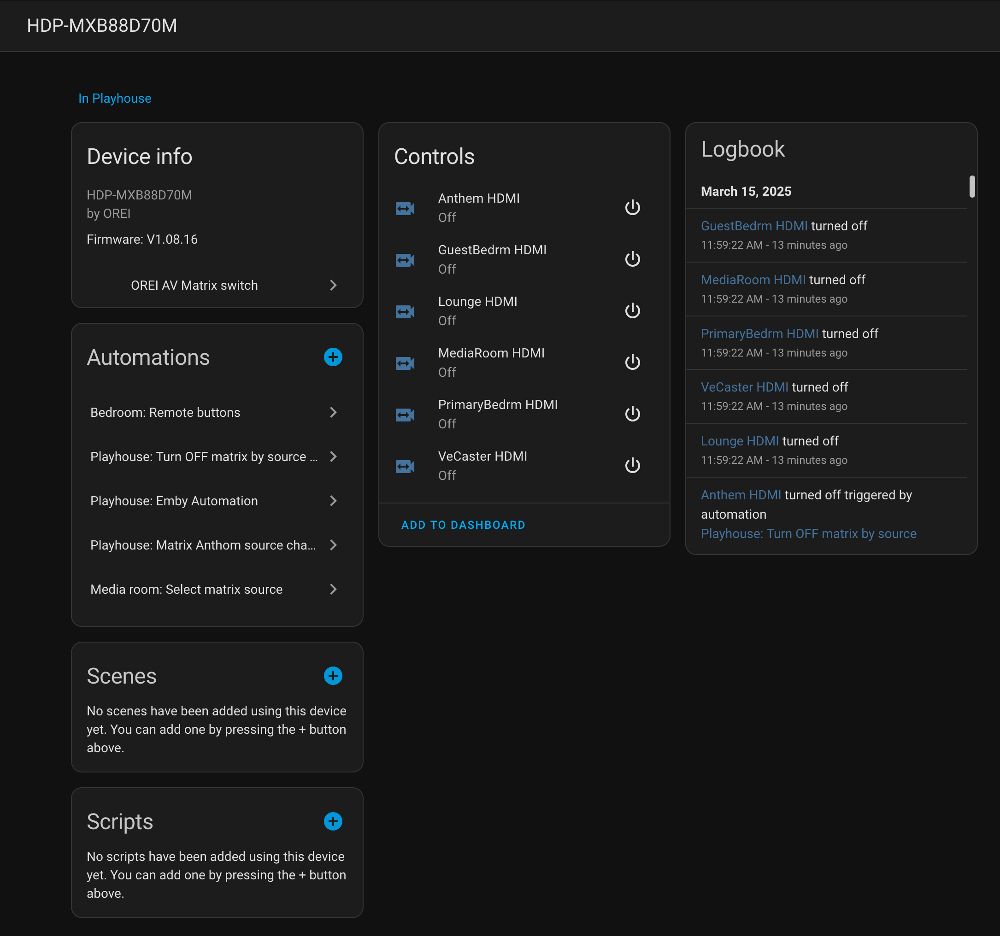

# hass-orei-uhd816
A [Home Assistant](https://www.home-assistant.io/) custom component for interacting with an [OREI Matrix Switch](https://www.orei.com/products/8-x-8-hdmi-matrix-switcher-extender-with-ir-function-over-cat5e-6-7-cable-uhd816-ex230-k)

## Features
- Web UI configuration
- One `media_player` entity for each configured output.
- Asynchronous updates from Matrix to Home Assistant, no polling.
- Support for the Home Assistant `media_player.select_source` service for switching inputs.
- Support for the Home Assistant `media_player.turn_on`, `media_player.turn_off`, and `media_player.mute` services to enable or disable a given output.



## Before Installation
This custom component will create a Home Assistant `media_player` entity for each of your matrix outputs. Each of those `media_player` entities will have the ability to select any of your matrix's input sources for it's output. Here are some tips to save you some time and effort.
 - Configure and test your Matrix according to the manufacturers directions first.
 - You may not be using all of your matrix's inputs or outputs. This component will skip and input or output with a default name (i.e. `"Input1"` or `"Output1"` ) UNLESS all inputs / outputs have default names.
 - Use a static IP address or better still a DHCP reservation from your matrix switch so that its IP address doesn't change.

## Installation via HACS
 - Install [HACS](https://hacs.xyz/) if you haven't already done so.
 - Add this repo to HACS as a custom repo.
 - Note that HACS will prompt you to restart Home Assistant. Do that.
 - Search for the `OREI AV Matrix switch` integration in the `Settings \ Integrations \ + Add Integration` Home Assistant UI. Provide the IP address of your matrix switch when prompted.

## Manual Installation
If you don't or can't use HACS then:
 - Copy the `custom_components/orei-uhd816` directory to your `custom_components` folder.
 - Restart Home Assistant.
 - Open your Home Assistant instance to your [integrations page.](https://my.home-assistant.io/redirect/integrations/)
 - Search for the `AOREI AV Matrix switch` integration in the `Settings \ Integrations \ + Add Integration` Home Assistant UI. Provide the IP address of your matrix switch when prompted.

## Give us some Love
If you use this custom component please give it a Star :star:

## How I use this...

My matrix is set up with five inputs:
 - AppleTV
 - NVidia Shield
 - Kaleidescape
 - Panasonic Blu-ray player
 - HTPC (That I use for short shows prior showing guests movies. I call these PreRolls).

And five outputs:
 - An Anthem AVM 90 for my 9.4.6 audio in the main theater (Which feeds my MadVR Envy Extreme video processor and my Sony Laser Projector)
 - A 65" Sony OLED for display in the lobby
 - LG TV in Primary bedroom
 - LG TV in Media room
 - LG TV in the Guest bedroom

 The MadVR Envy is a very powerful video processor and has separate settings for each of the separate input devices. One of the ways I automate this is via this script that ensures that the Envy is applying the correct input device profile whenever there's a change.

 I'm sure that you can find a good use yourself.

```yaml
alias: "Playhouse: Matrix Madvr source changes"
description: ""
trigger:
  - platform: state
    entity_id:
      - media_player.madvr_hdmi
    attribute: source
    to: AppleTV
    id: madvr_to_appleTv
  - platform: state
    entity_id:
      - media_player.madvr_hdmi
    attribute: source
    to: Shield
    id: madvr_to_Shield
  - platform: state
    entity_id:
      - media_player.madvr_hdmi
    attribute: source
    to: Blu-ray
    id: madvr_to_BluRay
  - platform: state
    entity_id:
      - media_player.madvr_hdmi
    attribute: source
    to: PreRoll
    id: madvr_to_PreRoll
condition: []
action:
  - choose:
      - conditions:
          - condition: trigger
            id:
              - madvr_to_appleTv
        sequence:
          - service: remote.send_command
            target:
              entity_id: remote.envy
            data:
              command: ActivateProfile source 1
      - conditions:
          - condition: trigger
            id:
              - madvr_to_Shield
        sequence:
          - service: remote.send_command
            target:
              entity_id: remote.envy
            data:
              command: ActivateProfile source 2
      - conditions:
          - condition: trigger
            id:
              - madvr_to_BluRay
        sequence:
          - service: remote.send_command
            target:
              entity_id: remote.envy
            data:
              command: ActivateProfile source 3
      - conditions:
          - condition: trigger
            id:
              - madvr_to_PreRoll
        sequence:
          - service: remote.send_command
            target:
              entity_id: remote.envy
            data:
              command: ActivateProfile source 4
mode: queued
max: 10

```